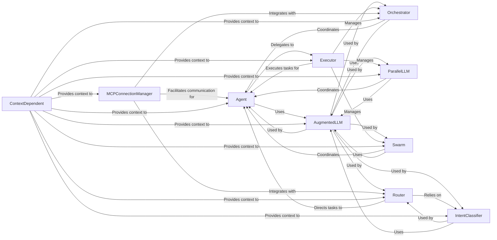

## Details

The "Agent & Workflow Framework" component is the backbone of the project, defining how AI agents are structured, how they interact, and how complex multi-agent behaviors are orchestrated. It provides the foundational abstractions and patterns necessary for building sophisticated AI systems.

### Agent

The fundamental building block of the AI system. It encapsulates an agent's core logic, capabilities, and interaction patterns, serving as the primary autonomous entity capable of performing tasks.

**Related Classes/Methods**:

- <a href="https://github.com/lastmile-ai/mcp-agent/blob/main/src/mcp_agent/agents/agent.py#L1-L1" target="_blank" rel="noopener noreferrer">`mcp_agent.agents.agent` (1:1)</a>

### AugmentedLLM

Provides a standardized and enhanced interface for interacting with various Large Language Models (LLMs) from different providers. It abstracts away provider-specific details and adds functionalities like prompt augmentation, token management, and structured output, making it the central LLM integration point for all agents and workflows.

**Related Classes/Methods**:

- <a href="https://github.com/lastmile-ai/mcp-agent/blob/main/src/mcp_agent/workflows/llm/augmented_llm.py#L1-L1" target="_blank" rel="noopener noreferrer">`mcp_agent.workflows.llm.augmented_llm` (1:1)</a>

### Orchestrator

A high-level workflow component responsible for coordinating multiple agents, tools, or sub-workflows to achieve complex, multi-step goals. It defines the overall flow and decision-making logic for sequential or conditional processes.

**Related Classes/Methods**:

- <a href="https://github.com/lastmile-ai/mcp-agent/blob/main/src/mcp_agent/workflows/orchestrator/orchestrator.py#L1-L1" target="_blank" rel="noopener noreferrer">`mcp_agent.workflows.orchestrator.orchestrator` (1:1)</a>

### ParallelLLM

Implements a workflow pattern designed for executing multiple LLM calls or agent tasks concurrently. It efficiently manages parallel interactions, distributing tasks (fan-out) and collecting results (fan-in) for improved throughput in multi-task scenarios.

**Related Classes/Methods**:

- <a href="https://github.com/lastmile-ai/mcp-agent/blob/main/src/mcp_agent/workflows/parallel/parallel_llm.py#L1-L1" target="_blank" rel="noopener noreferrer">`mcp_agent.workflows.parallel.parallel_llm` (1:1)</a>

### Swarm

Implements a multi-agent workflow pattern where a group of agents collaborates to solve a problem, often exhibiting emergent intelligence through collective action and iterative refinement. It facilitates communication and coordination among a group of agents.

**Related Classes/Methods**:

- <a href="https://github.com/lastmile-ai/mcp-agent/blob/main/src/mcp_agent/workflows/swarm/swarm.py#L1-L1" target="_blank" rel="noopener noreferrer">`mcp_agent.workflows.swarm.swarm` (1:1)</a>

### Router

A workflow component that intelligently directs incoming requests or tasks to the most appropriate agent, server, or sub-workflow. It makes dynamic routing decisions based on predefined rules or analysis of the request content.

**Related Classes/Methods**:

- <a href="https://github.com/lastmile-ai/mcp-agent/blob/main/src/mcp_agent/workflows/router/router_base.py#L1-L1" target="_blank" rel="noopener noreferrer">`mcp_agent.workflows.router.router_base` (1:1)</a>

### IntentClassifier

A workflow component designed to classify user input or system states into predefined intents. This is crucial for understanding the user's goal and enabling other workflow components (like the Router) to make informed decisions about subsequent actions.

**Related Classes/Methods**:

- <a href="https://github.com/lastmile-ai/mcp-agent/blob/main/src/mcp_agent/workflows/intent_classifier/intent_classifier_base.py#L1-L1" target="_blank" rel="noopener noreferrer">`mcp_agent.workflows.intent_classifier.intent_classifier_base` (1:1)</a>

### Executor

Manages and executes workflows and tasks, providing mechanisms for reliable execution, potentially integrating with durable execution systems. It ensures that complex, long-running agent processes can be reliably executed, paused, resumed, and monitored.

**Related Classes/Methods**:

- <a href="https://github.com/lastmile-ai/mcp-agent/blob/main/src/mcp_agent/executor/executor.py#L1-L1" target="_blank" rel="noopener noreferrer">`mcp_agent.executor.executor` (1:1)</a>

### MCPConnectionManager

Manages connections and interactions related to the Model Context Protocol (MCP). This component is crucial for enabling communication and data exchange between different parts of the agent system or with external MCP-compliant services, facilitating multi-agent collaboration.

**Related Classes/Methods**:

- <a href="https://github.com/lastmile-ai/mcp-agent/blob/main/src/mcp_agent/mcp/mcp_connection_manager.py#L1-L1" target="_blank" rel="noopener noreferrer">`mcp_agent.mcp.mcp_connection_manager` (1:1)</a>

### ContextDependent

A foundational abstract base class or pattern that provides a mechanism for components to depend on and interact with a shared `Context` object. It ensures that various parts of the agent system can access common resources, configurations, and state, promoting a consistent and manageable environment.

**Related Classes/Methods**:

- <a href="https://github.com/lastmile-ai/mcp-agent/blob/main/src/mcp_agent/core/context.py#L1-L1" target="_blank" rel="noopener noreferrer">`mcp_agent.core.context` (1:1)</a>

### [FAQ](https://github.com/CodeBoarding/GeneratedOnBoardings/tree/main?tab=readme-ov-file#faq)