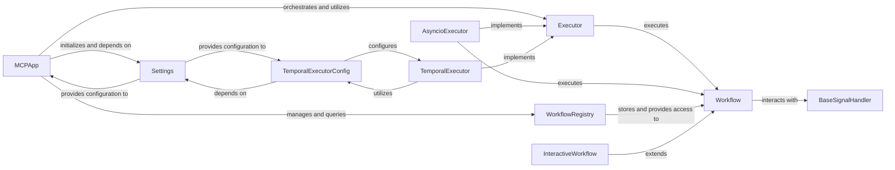

## Details

The Core Orchestration & Execution component is the central nervous system of the mcp-agent application, responsible for managing the overall application lifecycle, loading global configurations, and orchestrating the execution of tasks and complex workflows. It supports both asynchronous and durable execution models, ensuring robust workflow state management and enabling sophisticated agentic behaviors.

### MCPApp

The primary application orchestrator and entry point. It is responsible for bootstrapping the application, loading global configurations (Settings), and coordinating the various sub-systems. It manages the lifecycle of the application and delegates the execution of workflows to appropriate executors.

**Related Classes/Methods**:

- `MCPApp` (1:1)

### Settings

This component is responsible for managing and providing access to global application configurations. It loads settings from various sources, making them available to other components that require specific parameters for their operation (e.g., executor configurations, external service credentials).

**Related Classes/Methods**:

- `Settings` (1:1)

### Executor

This is the abstract interface for executing workflows and tasks within the mcp-agent framework. It defines the contract for how executable units are run, allowing for different concrete implementations to handle various execution environments, such as in-process asynchronous execution or durable execution via Temporal.io.

**Related Classes/Methods**:

- <a href="https://github.com/lastmile-ai/mcp-agent/blob/main/src/mcp_agent/executor/executor.py#L52-L239" target="_blank" rel="noopener noreferrer">`Executor` (52:239)</a>

### AsyncioExecutor

A concrete implementation of the Executor interface that handles asynchronous, in-process execution of workflows. It leverages Python's asyncio capabilities for concurrent task management, suitable for short-lived or non-durable workflows.

**Related Classes/Methods**:

- `AsyncioExecutor` (1:1)

### TemporalExecutor

A concrete implementation of the Executor interface that provides durable and fault-tolerant workflow execution using the Temporal.io platform. It ensures workflow state persistence, retries, and recovery, critical for long-running or mission-critical agentic processes.

**Related Classes/Methods**:

- `TemporalExecutor` (1:1)

### Workflow

This serves as the foundational abstraction for defining executable units of work or complex agentic processes. It encapsulates the logic, state, and potential interactions of a workflow, which is then managed and executed by an Executor.

**Related Classes/Methods**:

- <a href="https://github.com/lastmile-ai/mcp-agent/blob/main/src/mcp_agent/executor/workflow.py#L71-L528" target="_blank" rel="noopener noreferrer">`Workflow` (71:528)</a>

### WorkflowRegistry

This component is responsible for managing the registration and retrieval of workflow definitions. It acts as a central catalog, making workflows discoverable and available for execution by the system, supporting both in-memory and Temporal-backed storage.

**Related Classes/Methods**:

- <a href="https://github.com/lastmile-ai/mcp-agent/blob/main/src/mcp_agent/executor/workflow_registry.py#L19-L146" target="_blank" rel="noopener noreferrer">`WorkflowRegistry` (19:146)</a>

### BaseSignalHandler

This component provides the abstract mechanism for handling signals within workflows. Signals are crucial for inter-workflow communication, managing workflow state, and enabling external interactions, which are vital for robust and responsive execution in asynchronous and durable environments.

**Related Classes/Methods**:

- `BaseSignalHandler` (1:1)

### TemporalExecutorConfig

Defines the specific configuration parameters required for the TemporalExecutor to operate. This includes connection details for the Temporal server and other execution-specific settings, ensuring proper integration with the durable execution backend.

**Related Classes/Methods**:

- `TemporalExecutorConfig` (1:1)

### InteractiveWorkflow

A specialized type of Workflow designed to handle human interaction. This component is crucial for agentic systems that require user input or approval at various stages of a workflow, enabling human-in-the-loop processes and complex decision flows.

**Related Classes/Methods**:

- <a href="https://github.com/lastmile-ai/mcp-agent/blob/main/src/mcp_agent/executor/temporal/interactive_workflow.py#L20-L83" target="_blank" rel="noopener noreferrer">`InteractiveWorkflow` (20:83)</a>

### [FAQ](https://github.com/CodeBoarding/GeneratedOnBoardings/tree/main?tab=readme-ov-file#faq)