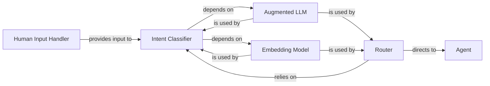

## Details

This component is central to how the AI agent framework understands user needs and directs the flow of execution. It encompasses the mechanisms for receiving user input, interpreting their underlying intent, and subsequently routing the request to the most appropriate agent or workflow. This design allows for flexible and intelligent handling of diverse user interactions, leveraging both advanced language models and efficient embedding techniques.

### Human Input Handler

This component serves as the primary interface for direct human interaction with the agent system. It is responsible for capturing and processing console input, including user commands (e.g., slash commands) and queries. It also facilitates elicitation, allowing the agent to prompt the user for necessary information.

**Related Classes/Methods**:

- <a href="https://github.com/lastmile-ai/mcp-agent/blob/main/src/mcp_agent/human_input/handler.py#L1-L1" target="_blank" rel="noopener noreferrer">`mcp_agent/human_input/handler.py` (1:1)</a>

### Intent Classifier

This abstract base component defines the contract for classifying incoming user input or system states into predefined intents. It is crucial for understanding the user's underlying goal or purpose, which is a prerequisite for effective decision-making within the agent system. The framework supports both LLM-based and embedding-based concrete implementations.

**Related Classes/Methods**:

- <a href="https://github.com/lastmile-ai/mcp-agent/blob/main/src/mcp_agent/workflows/intent_classifier/intent_classifier_base.py#L1-L1" target="_blank" rel="noopener noreferrer">`mcp_agent/workflows/intent_classifier/intent_classifier_base.py` (1:1)</a>

### Router

This abstract base component serves as a central dispatch mechanism within the agent's workflow. Its primary responsibility is to intelligently direct incoming requests or tasks to the most appropriate agent, server, or specific function based on the classified intent and other contextual information. It enables dynamic and flexible routing within the multi-agent orchestration platform.

**Related Classes/Methods**:

- <a href="https://github.com/lastmile-ai/mcp-agent/blob/main/src/mcp_agent/workflows/router/router_base.py#L1-L1" target="_blank" rel="noopener noreferrer">`mcp_agent/workflows/router/router_base.py` (1:1)</a>

### Augmented LLM

This component provides a unified and augmented interface for interacting with various Large Language Models (LLMs) from different providers (e.g., OpenAI, Anthropic, Google GenAI). It abstracts away the complexities of raw LLM APIs, offering functionalities like prompt engineering, token management, and structured output parsing, which are crucial for robust LLM-based intent classification and routing.

**Related Classes/Methods**:

- <a href="https://github.com/lastmile-ai/mcp-agent/blob/main/src/mcp_agent/workflows/llm/augmented_llm.py#L1-L1" target="_blank" rel="noopener noreferrer">`mcp_agent/workflows/llm/augmented_llm.py` (1:1)</a>

### Embedding Model

This component provides a standardized interface for generating numerical vector representations (embeddings) of text. These embeddings are fundamental for performing semantic similarity searches and classification tasks, which are utilized in embedding-based intent classification and routing.

**Related Classes/Methods**:

- <a href="https://github.com/lastmile-ai/mcp-agent/blob/main/src/mcp_agent/workflows/embedding/embedding_base.py#L1-L1" target="_blank" rel="noopener noreferrer">`mcp_agent/workflows/embedding/embedding_base.py` (1:1)</a>

### Agent

A generic agent or workflow that the Router directs requests to.

**Related Classes/Methods**: _None_

### [FAQ](https://github.com/CodeBoarding/GeneratedOnBoardings/tree/main?tab=readme-ov-file#faq)