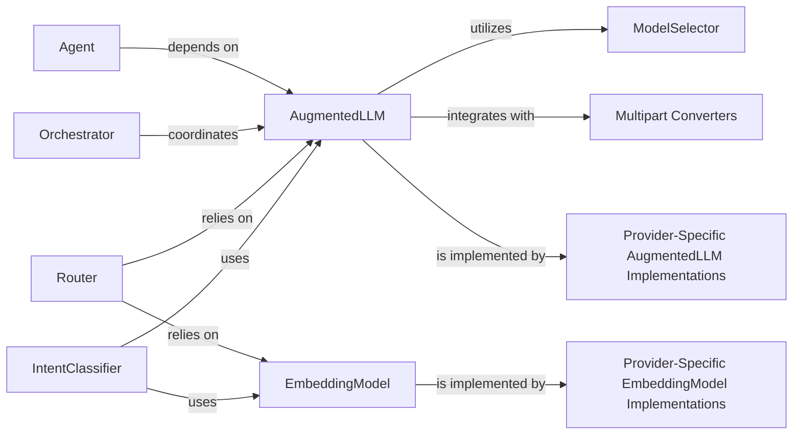

## Details

The LLM & External Tooling component is central to the mcp_agent project, providing the foundational capabilities for interacting with various Large Language Models (LLMs) and embedding services. It embodies the project's architectural bias towards abstraction, extensibility, and modularity, allowing the framework to seamlessly integrate with diverse AI providers and leverage their unique strengths.

### AugmentedLLM

This is the core abstract interface for all Large Language Model (LLM) interactions. It defines a unified API for sending requests and receiving responses from various LLM providers, abstracting away provider-specific details.

**Related Classes/Methods**:

- <a href="https://github.com/lastmile-ai/mcp-agent/blob/main/src/mcp_agent/workflows/llm/augmented_llm.py#L218-L668" target="_blank" rel="noopener noreferrer">`mcp_agent.workflows.llm.augmented_llm.AugmentedLLM` (218:668)</a>

### EmbeddingModel

An abstract interface for generating numerical embeddings from text. It provides a consistent way to interact with different embedding service providers.

**Related Classes/Methods**:

- <a href="https://github.com/lastmile-ai/mcp-agent/blob/main/src/mcp_agent/workflows/embedding/embedding_base.py#L13-L31" target="_blank" rel="noopener noreferrer">`mcp_agent.workflows.embedding.embedding_base.EmbeddingModel` (13:31)</a>

### ModelSelector

Responsible for dynamically selecting the most appropriate LLM model based on predefined criteria such as cost, latency, or specific model capabilities.

**Related Classes/Methods**:

- <a href="https://github.com/lastmile-ai/mcp-agent/blob/main/src/mcp_agent/workflows/llm/llm_selector.py#L96-L413" target="_blank" rel="noopener noreferrer">`mcp_agent.workflows.llm.llm_selector.ModelSelector` (96:413)</a>

### Multipart Converters

These modules handle the conversion of diverse content types (e.g., text, images, tool calls) between the internal Model Context Protocol (MCP) format and the specific input/output formats required by different LLM providers.

**Related Classes/Methods**:

- <a href="https://github.com/lastmile-ai/mcp-agent/blob/main/src/mcp_agent/workflows/llm/multipart_converter_anthropic.py" target="_blank" rel="noopener noreferrer">`mcp_agent.workflows.llm.multipart_converter_anthropic`</a>

- <a href="https://github.com/lastmile-ai/mcp-agent/blob/main/src/mcp_agent/workflows/llm/multipart_converter_openai.py" target="_blank" rel="noopener noreferrer">`mcp_agent.workflows.llm.multipart_converter_openai`</a>

### Provider-Specific AugmentedLLM Implementations

Concrete implementations of the AugmentedLLM abstract class for specific LLM providers (e.g., Anthropic, OpenAI, Google, Azure, Bedrock, Ollama). These classes contain the actual logic for making API calls to their respective LLM services.

**Related Classes/Methods**:

- <a href="https://github.com/lastmile-ai/mcp-agent/blob/main/src/mcp_agent/workflows/llm/augmented_llm_anthropic.py#L110-L722" target="_blank" rel="noopener noreferrer">`mcp_agent.workflows.llm.augmented_llm_anthropic.AnthropicAugmentedLLM` (110:722)</a>

- <a href="https://github.com/lastmile-ai/mcp-agent/blob/main/src/mcp_agent/workflows/llm/augmented_llm_openai.py#L80-L845" target="_blank" rel="noopener noreferrer">`mcp_agent.workflows.llm.augmented_llm_openai.OpenAIAugmentedLLM` (80:845)</a>

### Provider-Specific EmbeddingModel Implementations

Concrete implementations of the EmbeddingModel abstract class for specific embedding providers (e.g., Cohere, OpenAI). They handle the actual API calls to generate embeddings.

**Related Classes/Methods**:

- <a href="https://github.com/lastmile-ai/mcp-agent/blob/main/src/mcp_agent/workflows/embedding/embedding_cohere.py#L18-L72" target="_blank" rel="noopener noreferrer">`mcp_agent.workflows.embedding.embedding_cohere.CohereEmbeddingModel` (18:72)</a>

- <a href="https://github.com/lastmile-ai/mcp-agent/blob/main/src/mcp_agent/workflows/embedding/embedding_openai.py#L18-L70" target="_blank" rel="noopener noreferrer">`mcp_agent.workflows.embedding.embedding_openai.OpenAIEmbeddingModel` (18:70)</a>

### Agent

Represents the core intelligent entity within the framework, responsible for understanding tasks, making decisions, and executing actions, often by interacting with LLMs and external tools.

**Related Classes/Methods**:

- <a href="https://github.com/lastmile-ai/mcp-agent/blob/main/src/mcp_agent/agents/agent.py#L56-L931" target="_blank" rel="noopener noreferrer">`mcp_agent.agents.agent.Agent` (56:931)</a>

### Orchestrator

Manages and coordinates complex, multi-step workflows, often involving multiple LLM calls, tool uses, and interactions between different agents.

**Related Classes/Methods**:

- <a href="https://github.com/lastmile-ai/mcp-agent/blob/main/src/mcp_agent/workflows/orchestrator/orchestrator.py#L45-L585" target="_blank" rel="noopener noreferrer">`mcp_agent.workflows.orchestrator.orchestrator.Orchestrator` (45:585)</a>

### Router

Intelligently directs incoming requests or internal queries to the most appropriate LLM or embedding model/service based on context, intent, or other routing criteria.

**Related Classes/Methods**:

- <a href="https://github.com/lastmile-ai/mcp-agent/blob/main/src/mcp_agent/workflows/router/router_llm.py#L81-L373" target="_blank" rel="noopener noreferrer">`mcp_agent.workflows.router.router_llm.LLMRouter` (81:373)</a>

- <a href="https://github.com/lastmile-ai/mcp-agent/blob/main/src/mcp_agent/workflows/router/router_embedding.py#L28-L239" target="_blank" rel="noopener noreferrer">`mcp_agent.workflows.router.router_embedding.EmbeddingRouter` (28:239)</a>

### IntentClassifier

Determines the underlying intent of a user query or system state, leveraging either LLMs or embedding models for classification.

**Related Classes/Methods**:

- <a href="https://github.com/lastmile-ai/mcp-agent/blob/main/src/mcp_agent/workflows/intent_classifier/intent_classifier_llm.py#L63-L243" target="_blank" rel="noopener noreferrer">`mcp_agent.workflows.intent_classifier.intent_classifier_llm.LLMIntentClassifier` (63:243)</a>

- <a href="https://github.com/lastmile-ai/mcp-agent/blob/main/src/mcp_agent/workflows/intent_classifier/intent_classifier_embedding.py#L32-L177" target="_blank" rel="noopener noreferrer">`mcp_agent.workflows.intent_classifier.intent_classifier_embedding.EmbeddingIntentClassifier` (32:177)</a>

### [FAQ](https://github.com/CodeBoarding/GeneratedOnBoardings/tree/main?tab=readme-ov-file#faq)