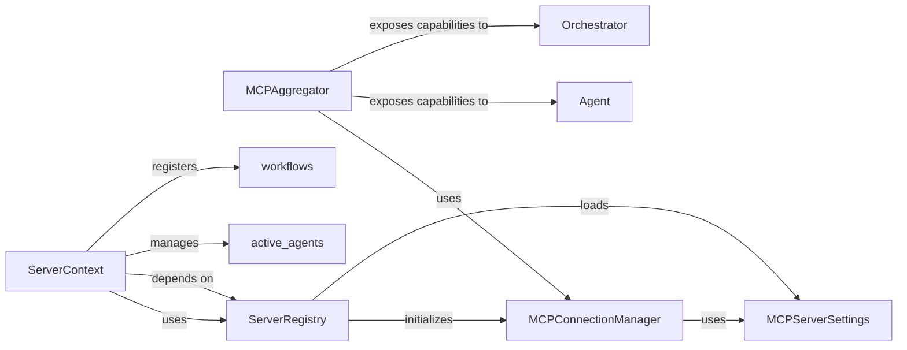

## Details

Final Component Overview for `MCP & API Gateway`. This component serves as the primary interface for external communication, exposing agent capabilities and workflows via the Model Context Protocol (MCP) and managing connections to other MCP servers. It provides the necessary server-side infrastructure for remote access and interaction. These five components are fundamental to the `MCP & API Gateway` subsystem because they collectively manage the entire lifecycle of external communication and capability exposure, aligning with the project's 'AI Agent Framework/Orchestration Platform' nature: `MCPServerSettings` provides the essential configuration for defining how MCP servers are accessed and behave. It's the blueprint for connectivity. `ServerRegistry` acts as the central directory and initializer for all MCP servers. It's crucial for discovering and bringing online the various services that agents can interact with. `MCPConnectionManager` manages the actual network connections, ensuring reliable communication with both local and remote MCP services. It's the operational backbone for data exchange. `MCPAggregator` embodies the 'API Gateway' pattern. It consolidates capabilities from disparate MCP servers into a single, unified interface for agents, abstracting away connection complexities. This is vital for enabling seamless 'Multi-Agent Coordination Mechanisms' and 'Tool Use Frameworks.' `ServerContext` provides the runtime environment for the MCP application server, integrating the FastAPI application, agent management, and workflow registration. It ensures that the exposed capabilities are functional and accessible, supporting the 'Asynchronous Execution Engine' and 'Workflow Patterns.' Together, these components enable the project to effectively expose agent capabilities, manage external MCP server connections, and provide the necessary server-side infrastructure for remote access and interaction, which are critical for an AI Agent Framework/Orchestration Platform.

### MCPAggregator

The MCPAggregator is a core component responsible for discovering and consolidating capabilities (tools, prompts, and resources) from multiple MCP servers. It acts as a central point for an agent to access and invoke functionalities provided by various remote or local MCP services. It manages persistent connections to servers and provides methods for listing, reading, and calling these aggregated capabilities.

**Related Classes/Methods**:

- <a href="https://github.com/lastmile-ai/mcp-agent/blob/main/src/mcp_agent/mcp/mcp_aggregator.py#L1-L1" target="_blank" rel="noopener noreferrer">`mcp_agent/mcp/mcp_aggregator.py` (1:1)</a>

### ServerRegistry

The ServerRegistry is responsible for managing the configuration and initialization of MCP servers. It loads server configurations from a YAML file, registers initialization hooks, and provides methods to start and initialize server processes based on their defined transport (stdio, streamable HTTP, SSE, websocket). It acts as a directory of available MCP servers.

**Related Classes/Methods**:

- <a href="https://github.com/lastmile-ai/mcp-agent/blob/main/src/mcp_agent/mcp/mcp_server_registry.py#L1-L1" target="_blank" rel="noopener noreferrer">`mcp_agent/mcp/mcp_server_registry.py` (1:1)</a>

### ServerContext

The ServerContext provides the operational context for the MCP application server. It holds references to the FastMCP instance (the FastAPI application for MCP), manages active agents, and initializes the appropriate workflow registry (either InMemoryWorkflowRegistry for asyncio or TemporalWorkflowRegistry for Temporal.io). It also facilitates the registration of workflows and the creation of workflow-specific tools.

**Related Classes/Methods**:

- <a href="https://github.com/lastmile-ai/mcp-agent/blob/main/src/mcp_agent/server/app_server.py#L1-L1" target="_blank" rel="noopener noreferrer">`mcp_agent/server/app_server.py` (1:1)</a>

### MCPConnectionManager

The MCPConnectionManager is responsible for establishing, maintaining, and closing connections to various MCP servers. It handles the underlying communication protocols and ensures reliable data exchange between the MCPAggregator and the remote MCP services.

**Related Classes/Methods**:

- <a href="https://github.com/lastmile-ai/mcp-agent/blob/main/src/mcp_agent/mcp/mcp_connection_manager.py#L1-L1" target="_blank" rel="noopener noreferrer">`mcp_agent/mcp/mcp_connection_manager.py` (1:1)</a>

### MCPServerSettings

MCPServerSettings defines the configuration parameters for individual MCP servers, including their transport type (e.g., stdio, http, websocket), host, port, and other connection-related details. It is a foundational data structure for setting up and connecting to MCP services.

**Related Classes/Methods**:

- <a href="https://github.com/lastmile-ai/mcp-agent/blob/main/src/mcp_agent/config.py#L1-L1" target="_blank" rel="noopener noreferrer">`mcp_agent/config.py` (1:1)</a>

### [FAQ](https://github.com/CodeBoarding/GeneratedOnBoardings/tree/main?tab=readme-ov-file#faq)