```mermaid

graph LR

    Core_Orchestration_Execution["Core Orchestration & Execution"]

    Agent_Workflow_Framework["Agent & Workflow Framework"]

    LLM_External_Tooling["LLM & External Tooling"]

    MCP_API_Gateway["MCP & API Gateway"]

    Intent_Interaction_Management["Intent & Interaction Management"]

    Core_Orchestration_Execution -- "Initializes/Configures" --> Agent_Workflow_Framework

    Core_Orchestration_Execution -- "Manages" --> Agent_Workflow_Framework

    Agent_Workflow_Framework -- "Uses" --> LLM_External_Tooling

    Agent_Workflow_Framework -- "Executes via" --> Core_Orchestration_Execution

    LLM_External_Tooling -- "Provides services to" --> Agent_Workflow_Framework

    LLM_External_Tooling -- "Provides services to" --> Intent_Interaction_Management

    MCP_API_Gateway -- "Exposes" --> Core_Orchestration_Execution

    MCP_API_Gateway -- "Sends requests to" --> Intent_Interaction_Management

    Intent_Interaction_Management -- "Routes requests to" --> Core_Orchestration_Execution

    Intent_Interaction_Management -- "Utilizes" --> LLM_External_Tooling

    click Core_Orchestration_Execution href "https://github.com/lastmile-ai/mcp-agent/blob/main/.codeboarding//Core_Orchestration_Execution.md" "Details"

    click Agent_Workflow_Framework href "https://github.com/lastmile-ai/mcp-agent/blob/main/.codeboarding//Agent_Workflow_Framework.md" "Details"

    click LLM_External_Tooling href "https://github.com/lastmile-ai/mcp-agent/blob/main/.codeboarding//LLM_External_Tooling.md" "Details"

    click MCP_API_Gateway href "https://github.com/lastmile-ai/mcp-agent/blob/main/.codeboarding//MCP_API_Gateway.md" "Details"

    click Intent_Interaction_Management href "https://github.com/lastmile-ai/mcp-agent/blob/main/.codeboarding//Intent_Interaction_Management.md" "Details"

```

## Details

The `mcp-agent` project is designed as a robust AI Agent Framework and Orchestration Platform, emphasizing modularity, extensibility, and asynchronous execution. The architecture is centered around a few key components that manage the lifecycle, execution, and interaction of AI agents and their workflows.

### Core Orchestration & Execution [[Expand]](./Core_Orchestration_Execution.md)

This component is the central nervous system of the application. It handles the overall application lifecycle, loads global configurations, and manages the execution of tasks and complex workflows. It supports both asynchronous and durable execution models, ensuring robust workflow state management.

**Related Classes/Methods**:

- <a href="https://github.com/lastmile-ai/mcp-agent/blob/main/src/mcp_agent/app.py#L34-L508" target="_blank" rel="noopener noreferrer">`mcp_agent.app.MCPApp` (34:508)</a>

- <a href="https://github.com/lastmile-ai/mcp-agent/blob/main/src/mcp_agent/config.py#L1-L1" target="_blank" rel="noopener noreferrer">`mcp_agent.config.Settings` (1:1)</a>

- <a href="https://github.com/lastmile-ai/mcp-agent/blob/main/src/mcp_agent/executor/executor.py#L52-L239" target="_blank" rel="noopener noreferrer">`mcp_agent.executor.executor.Executor` (52:239)</a>

- <a href="https://github.com/lastmile-ai/mcp-agent/blob/main/src/mcp_agent/executor/workflow.py#L71-L528" target="_blank" rel="noopener noreferrer">`mcp_agent.executor.workflow.Workflow` (71:528)</a>

### Agent & Workflow Framework [[Expand]](./Agent_Workflow_Framework.md)

This component defines the foundational interfaces and common behaviors for all AI agents. It implements reusable multi-agent workflow patterns (e.g., orchestration, parallel execution, swarm intelligence, evaluation), providing structured approaches for complex agentic behaviors.

**Related Classes/Methods**:

- <a href="https://github.com/lastmile-ai/mcp-agent/blob/main/src/mcp_agent/agents/agent.py#L56-L931" target="_blank" rel="noopener noreferrer">`mcp_agent.agents.agent.Agent` (56:931)</a>

- <a href="https://github.com/lastmile-ai/mcp-agent/blob/main/src/mcp_agent/workflows/orchestrator/orchestrator.py#L45-L585" target="_blank" rel="noopener noreferrer">`mcp_agent.workflows.orchestrator.orchestrator.Orchestrator` (45:585)</a>

- <a href="https://github.com/lastmile-ai/mcp-agent/blob/main/src/mcp_agent/workflows/parallel/parallel_llm.py#L23-L279" target="_blank" rel="noopener noreferrer">`mcp_agent.workflows.parallel.parallel_llm.ParallelLLM` (23:279)</a>

- <a href="https://github.com/lastmile-ai/mcp-agent/blob/main/src/mcp_agent/workflows/swarm/swarm.py#L189-L310" target="_blank" rel="noopener noreferrer">`mcp_agent.workflows.swarm.swarm.Swarm` (189:310)</a>

### LLM & External Tooling [[Expand]](./LLM_External_Tooling.md)

This component provides a unified and abstracted interface for interacting with various Large Language Model (LLM) and embedding providers. It handles model selection, request parameterization, and content conversion. Additionally, it offers a flexible framework for defining and integrating external tools that agents can leverage.

**Related Classes/Methods**:

- <a href="https://github.com/lastmile-ai/mcp-agent/blob/main/src/mcp_agent/workflows/llm/augmented_llm.py#L218-L668" target="_blank" rel="noopener noreferrer">`mcp_agent.workflows.llm.augmented_llm.AugmentedLLM` (218:668)</a>

- <a href="https://github.com/lastmile-ai/mcp-agent/blob/main/src/mcp_agent/workflows/llm/llm_selector.py#L96-L413" target="_blank" rel="noopener noreferrer">`mcp_agent.workflows.llm.llm_selector.ModelSelector` (96:413)</a>

- <a href="https://github.com/lastmile-ai/mcp-agent/blob/main/src/mcp_agent/workflows/embedding/embedding_base.py#L13-L31" target="_blank" rel="noopener noreferrer">`mcp_agent.workflows.embedding.embedding_base.EmbeddingModel` (13:31)</a>

- <a href="https://github.com/lastmile-ai/mcp-agent/blob/main/src/mcp_agent/utils/pydantic_type_serializer.py#L1-L1" target="_blank" rel="noopener noreferrer">`mcp_agent.utils.pydantic_type_serializer` (1:1)</a>

### MCP & API Gateway [[Expand]](./MCP_API_Gateway.md)

This component serves as the primary interface for external communication. It exposes agent capabilities and workflows via the Model Context Protocol (MCP) and manages connections to other MCP servers. It provides the necessary server-side infrastructure for remote access and interaction.

**Related Classes/Methods**:

- <a href="https://github.com/lastmile-ai/mcp-agent/blob/main/src/mcp_agent/mcp/mcp_aggregator.py#L77-L1357" target="_blank" rel="noopener noreferrer">`mcp_agent.mcp.mcp_aggregator.MCPAggregator` (77:1357)</a>

- <a href="https://github.com/lastmile-ai/mcp-agent/blob/main/src/mcp_agent/mcp/mcp_server_registry.py#L1-L1" target="_blank" rel="noopener noreferrer">`mcp_agent.mcp.mcp_server_registry.ServerRegistry` (1:1)</a>

- <a href="https://github.com/lastmile-ai/mcp-agent/blob/main/src/mcp_agent/server/app_server.py#L1-L1" target="_blank" rel="noopener noreferrer">`mcp_agent.server.app_server.ServerContext` (1:1)</a>

### Intent & Interaction Management [[Expand]](./Intent_Interaction_Management.md)

This component is responsible for understanding user intent and directing incoming requests or messages to the appropriate agent or workflow. It supports both LLM-based and embedding-based classification methods and manages direct human interaction, including console input and elicitation.

**Related Classes/Methods**:

- <a href="https://github.com/lastmile-ai/mcp-agent/blob/main/src/mcp_agent/workflows/router/router_base.py#L63-L275" target="_blank" rel="noopener noreferrer">`mcp_agent.workflows.router.router_base.Router` (63:275)</a>

- <a href="https://github.com/lastmile-ai/mcp-agent/blob/main/src/mcp_agent/workflows/intent_classifier/intent_classifier_base.py#L42-L85" target="_blank" rel="noopener noreferrer">`mcp_agent.workflows.intent_classifier.intent_classifier_base.IntentClassifier` (42:85)</a>

- <a href="https://github.com/lastmile-ai/mcp-agent/blob/main/src/mcp_agent/human_input/handler.py#L1-L1" target="_blank" rel="noopener noreferrer">`mcp_agent.human_input.handler` (1:1)</a>

### [FAQ](https://github.com/CodeBoarding/GeneratedOnBoardings/tree/main?tab=readme-ov-file#faq)