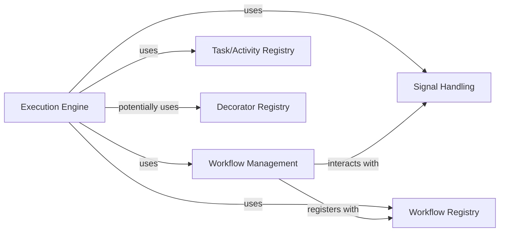

<Info>
This documentation was generated by [CodeBoarding](https://github.com/CodeBoarding/GeneratedOnBoardings) to provide comprehensive architectural insights into the mcp-agent framework.
</Info>

## Details

Abstract Components Overview

### Execution Engine
This is the core component responsible for the actual execution of tasks and activities. It provides an abstract interface (Executor) for running executable units, with concrete implementations like AsyncioExecutor for immediate asynchronous execution and TemporalExecutor for durable, long-running workflows. It manages the runtime environment for tasks and orchestrates their execution flow.

**Related Classes/Methods**:

- <a href="https://github.com/lastmile-ai/mcp-agent/blob/main/src/mcp_agent/executor/executor.py" target="_blank" rel="noopener noreferrer">`mcp_agent/executor/executor.py`</a>
- <a href="https://github.com/lastmile-ai/mcp-agent/blob/main/mcp_agent/executor/temporal/TemporalExecutor.py" target="_blank" rel="noopener noreferrer">`mcp_agent/executor/temporal/TemporalExecutor.py`</a>

### Workflow Management
This component defines the structure, state, and lifecycle of complex, multi-step processes. It provides the Workflow abstraction, allowing for the definition of sequences of tasks and decision points. InteractiveWorkflow specifically handles scenarios requiring human input or external interaction, enabling robust and adaptable agent workflows.

**Related Classes/Methods**:

- <a href="https://github.com/lastmile-ai/mcp-agent/blob/main/src/mcp_agent/executor/workflow.py" target="_blank" rel="noopener noreferrer">`mcp_agent/executor/workflow.py`</a>
- <a href="https://github.com/lastmile-ai/mcp-agent/blob/main/src/mcp_agent/executor/temporal/interactive_workflow.py" target="_blank" rel="noopener noreferrer">`mcp_agent/executor/temporal/interactive_workflow.py`</a>

### Task/Activity Registry
A centralized repository that allows for the registration and dynamic retrieval of executable tasks or "activities." This component is crucial for the Execution Engine to discover and invoke the specific functions or methods that constitute an agent's capabilities or a workflow's steps. It promotes modularity by decoupling task definition from task execution.

**Related Classes/Methods**:

- <a href="https://github.com/lastmile-ai/mcp-agent/blob/main/src/mcp_agent/executor/task_registry.py" target="_blank" rel="noopener noreferrer">`mcp_agent/executor/task_registry.py`</a>

### Signal Handling
This component provides a robust mechanism for inter-component communication and handling external events, including human input. It enables workflows and tasks to asynchronously wait for, send, and receive signals, which is vital for interactive processes, state transitions, and coordination within the agent system. It includes a registry for managing various signal handlers.

**Related Classes/Methods**:

- <a href="https://github.com/lastmile-ai/mcp-agent/blob/main/src/mcp_agent/executor/signal_registry.py" target="_blank" rel="noopener noreferrer">`mcp_agent/executor/signal_registry.py`</a>
- <a href="https://github.com/lastmile-ai/mcp-agent/blob/main/src/mcp_agent/executor/workflow_signal.py" target="_blank" rel="noopener noreferrer">`mcp_agent/executor/workflow_signal.py`</a>

### Decorator Registry
This component serves as a dedicated registry for managing decorators that can be applied to tasks or workflows. It facilitates the application of cross-cutting concerns (e.g., logging, error handling, retry mechanisms, authentication) in a declarative manner, enhancing the extensibility and maintainability of the executable units without modifying their core logic.

**Related Classes/Methods**:

- <a href="https://github.com/lastmile-ai/mcp-agent/blob/main/src/mcp_agent/executor/decorator_registry.py" target="_blank" rel="noopener noreferrer">`mcp_agent/executor/decorator_registry.py`</a>

### Workflow Registry
This component is responsible for registering and providing access to defined workflow blueprints. It allows the system to dynamically discover and instantiate workflows based on their unique identifiers, supporting different underlying storage or persistence mechanisms (e.g., in-memory for transient workflows, Temporal for durable workflows).

**Related Classes/Methods**:

- <a href="https://github.com/lastmile-ai/mcp-agent/blob/main/src/mcp_agent/executor/workflow_registry.py" target="_blank" rel="noopener noreferrer">`mcp_agent/executor/workflow_registry.py`</a>
- <a href="https://github.com/lastmile-ai/mcp-agent/blob/main/src/mcp_agent/executor/temporal/workflow_registry.py" target="_blank" rel="noopener noreferrer">`mcp_agent/executor/temporal/workflow_registry.py`</a>

### [FAQ](https://github.com/CodeBoarding/GeneratedOnBoardings/tree/main?tab=readme-ov-file#faq)