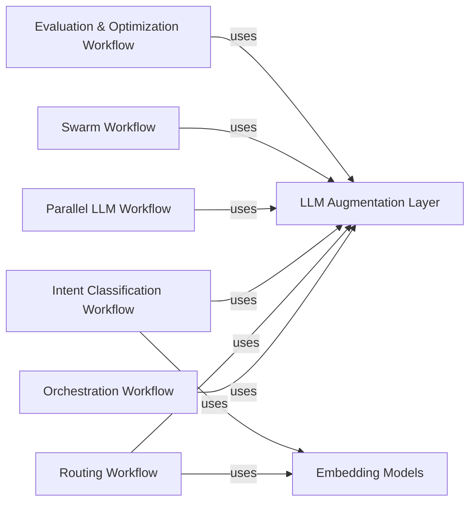

<Info>
This documentation was generated by [CodeBoarding](https://github.com/CodeBoarding/GeneratedOnBoardings) to provide comprehensive architectural insights into the mcp-agent framework.
</Info>

## Details

Abstract Components Overview

### LLM Augmentation Layer
This foundational component provides a unified and augmented interface for interacting with various Large Language Models (LLMs) from different providers (e.g., Anthropic, OpenAI, Google). It abstracts away provider-specific API calls, handles structured completion, and integrates with the agent's context. It also includes a ModelSelector for choosing optimal LLMs.

**Related Classes/Methods**:

- <a href="https://github.com/lastmile-ai/mcp-agent/blob/main/src/mcp_agent/workflows/llm/augmented_llm.py#L218-L668" target="_blank" rel="noopener noreferrer">`mcp_agent.workflows.llm.augmented_llm.AugmentedLLM` (218:668)</a>
- <a href="https://github.com/lastmile-ai/mcp-agent/blob/main/src/mcp_agent/workflows/llm/llm_selector.py#L96-L413" target="_blank" rel="noopener noreferrer">`mcp_agent.workflows.llm.llm_selector.ModelSelector` (96:413)</a>
- <a href="https://github.com/lastmile-ai/mcp-agent/blob/main/src/mcp_agent/workflows/llm/augmented_llm_anthropic.py#L110-L722" target="_blank" rel="noopener noreferrer">`mcp_agent.workflows.llm.augmented_llm_anthropic.AnthropicAugmentedLLM` (110:722)</a>

### Embedding Models
This component offers a standardized interface for generating and managing text embeddings using various underlying embedding models (e.g., Cohere, OpenAI). These vector representations of text are crucial for semantic search, similarity comparisons, and other vector-based operations.

**Related Classes/Methods**:

- <a href="https://github.com/lastmile-ai/mcp-agent/blob/main/src/mcp_agent/workflows/embedding/embedding_base.py#L13-L31" target="_blank" rel="noopener noreferrer">`mcp_agent.workflows.embedding.embedding_base.EmbeddingModel` (13:31)</a>
- <a href="https://github.com/lastmile-ai/mcp-agent/blob/main/src/mcp_agent/workflows/embedding/embedding_cohere.py#L18-L72" target="_blank" rel="noopener noreferrer">`mcp_agent.workflows.embedding.embedding_cohere.CohereEmbeddingModel` (18:72)</a>
- <a href="https://github.com/lastmile-ai/mcp-agent/blob/main/src/mcp_agent/workflows/embedding/embedding_openai.py#L18-L70" target="_blank" rel="noopener noreferrer">`mcp_agent.workflows.embedding.embedding_openai.OpenAIEmbeddingModel` (18:70)</a>

### Orchestration Workflow
Responsible for managing complex, multi-step agent behaviors. It defines how agents plan, execute, and refine sequences of actions and tasks, often involving iterative processes and dynamic task management. This enables agents to break down complex problems into manageable steps and coordinate their execution.

**Related Classes/Methods**:

- <a href="https://github.com/lastmile-ai/mcp-agent/blob/main/src/mcp_agent/workflows/orchestrator/orchestrator.py#L45-L585" target="_blank" rel="noopener noreferrer">`mcp_agent.workflows.orchestrator.orchestrator.Orchestrator` (45:585)</a>
- <a href="https://github.com/lastmile-ai/mcp-agent/blob/main/src/mcp_agent/workflows/orchestrator/orchestrator_models.py#L26-L31" target="_blank" rel="noopener noreferrer">`mcp_agent.workflows.orchestrator.orchestrator_models.AgentTask` (26:31)</a>
- <a href="https://github.com/lastmile-ai/mcp-agent/blob/main/src/mcp_agent/workflows/orchestrator/orchestrator_prompts.py" target="_blank" rel="noopener noreferrer">`mcp_agent.workflows.orchestrator.orchestrator_prompts`</a>

### Routing Workflow
Intelligently directs incoming requests or tasks to the most appropriate agent, tool, or sub-workflow. It supports various routing strategies, including LLM-based decision-making and embedding-based similarity matching, enabling dynamic and context-aware task distribution within the agent system.

**Related Classes/Methods**:

- <a href="https://github.com/lastmile-ai/mcp-agent/blob/main/src/mcp_agent/workflows/router/router_base.py#L63-L275" target="_blank" rel="noopener noreferrer">`mcp_agent.workflows.router.router_base.Router` (63:275)</a>
- <a href="https://github.com/lastmile-ai/mcp-agent/blob/main/src/mcp_agent/workflows/router/router_llm.py#L81-L373" target="_blank" rel="noopener noreferrer">`mcp_agent.workflows.router.router_llm.LLMRouter` (81:373)</a>
- <a href="https://github.com/lastmile-ai/mcp-agent/blob/main/src/mcp_agent/workflows/router/router_embedding.py#L28-L239" target="_blank" rel="noopener noreferrer">`mcp_agent.workflows.router.router_embedding.EmbeddingRouter` (28:239)</a>

### Intent Classification Workflow
Dedicated to identifying the underlying intent of a user's query or system message. It leverages both LLM-based reasoning and embedding-based similarity to accurately classify intents, which then informs the agent's subsequent actions or selection of appropriate workflows.

**Related Classes/Methods**:

- <a href="https://github.com/lastmile-ai/mcp-agent/blob/main/src/mcp_agent/workflows/intent_classifier/intent_classifier_base.py#L42-L85" target="_blank" rel="noopener noreferrer">`mcp_agent.workflows.intent_classifier.intent_classifier_base.IntentClassifier` (42:85)</a>
- <a href="https://github.com/lastmile-ai/mcp-agent/blob/main/src/mcp_agent/workflows/intent_classifier/intent_classifier_llm.py#L63-L243" target="_blank" rel="noopener noreferrer">`mcp_agent.workflows.intent_classifier.intent_classifier_llm.LLMIntentClassifier` (63:243)</a>
- <a href="https://github.com/lastmile-ai/mcp-agent/blob/main/src/mcp_agent/workflows/intent_classifier/intent_classifier_embedding.py#L32-L177" target="_blank" rel="noopener noreferrer">`mcp_agent.workflows.intent_classifier.intent_classifier_embedding.EmbeddingIntentClassifier` (32:177)</a>

### Parallel LLM Workflow
Enables the concurrent execution of multiple LLM calls or agent actions. It implements "fan-out" to distribute tasks in parallel and "fan-in" to aggregate their results, significantly improving the efficiency and throughput of LLM-intensive operations.

**Related Classes/Methods**:

- <a href="https://github.com/lastmile-ai/mcp-agent/blob/main/src/mcp_agent/workflows/parallel/parallel_llm.py#L23-L279" target="_blank" rel="noopener noreferrer">`mcp_agent.workflows.parallel.parallel_llm.ParallelLLM` (23:279)</a>
- <a href="https://github.com/lastmile-ai/mcp-agent/blob/main/src/mcp_agent/workflows/parallel/fan_in.py#L30-L422" target="_blank" rel="noopener noreferrer">`mcp_agent.workflows.parallel.fan_in.FanIn` (30:422)</a>
- <a href="https://github.com/lastmile-ai/mcp-agent/blob/main/src/mcp_agent/workflows/parallel/fan_out.py#L23-L243" target="_blank" rel="noopener noreferrer">`mcp_agent.workflows.parallel.fan_out.FanOut` (23:243)</a>

### Swarm Workflow
Facilitates collaborative problem-solving among multiple agents. It enables agents to interact, share information, and collectively work towards a common goal, supporting complex, distributed agent behaviors and multi-agent systems.

**Related Classes/Methods**:

- <a href="https://github.com/lastmile-ai/mcp-agent/blob/main/src/mcp_agent/workflows/swarm/swarm.py#L189-L310" target="_blank" rel="noopener noreferrer">`mcp_agent.workflows.swarm.swarm.Swarm` (189:310)</a>
- <a href="https://github.com/lastmile-ai/mcp-agent/blob/main/src/mcp_agent/workflows/swarm/swarm_anthropic.py#L8-L41" target="_blank" rel="noopener noreferrer">`mcp_agent.workflows.swarm.swarm_anthropic.AnthropicSwarm` (8:41)</a>
- <a href="https://github.com/lastmile-ai/mcp-agent/blob/main/src/mcp_agent/workflows/swarm/swarm_openai.py#L8-L40" target="_blank" rel="noopener noreferrer">`mcp_agent.workflows.swarm.swarm_openai.OpenAISwarm` (8:40)</a>

### Evaluation & Optimization Workflow
Provides mechanisms for evaluating the performance, quality, and effectiveness of agent outputs or entire workflows. It can be used to assess responses, identify areas for improvement, and potentially guide the agent towards optimizing its future actions.

**Related Classes/Methods**:

- <a href="https://github.com/lastmile-ai/mcp-agent/blob/main/src/mcp_agent/workflows/evaluator_optimizer/evaluator_optimizer.py#L47-L475" target="_blank" rel="noopener noreferrer">`mcp_agent.workflows.evaluator_optimizer.evaluator_optimizer.EvaluatorOptimizerLLM` (47:475)</a>

### [FAQ](https://github.com/CodeBoarding/GeneratedOnBoardings/tree/main?tab=readme-ov-file#faq)