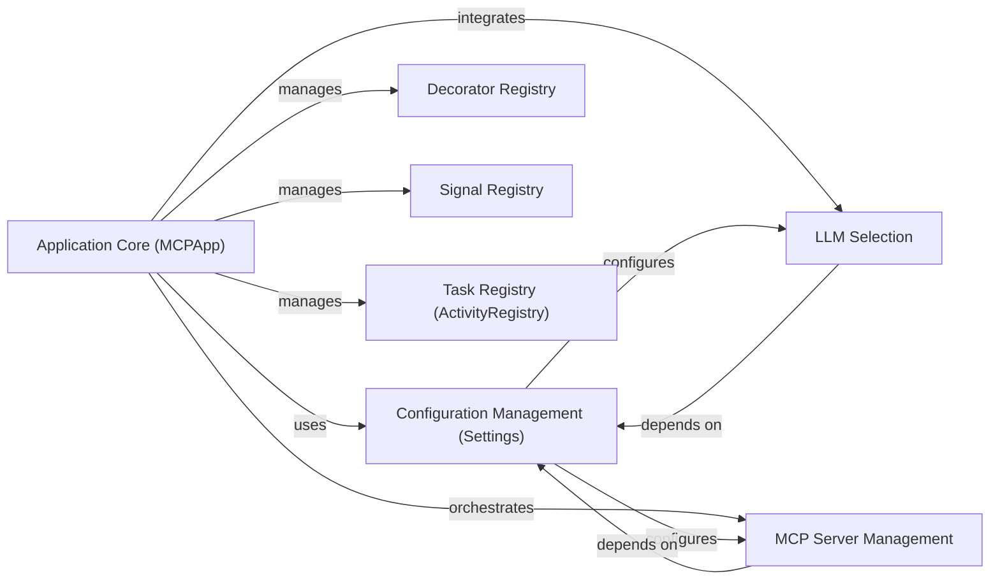

<Info>
This documentation was generated by [CodeBoarding](https://github.com/CodeBoarding/GeneratedOnBoardings) to provide comprehensive architectural insights into the mcp-agent framework.
</Info>

## Details

This component is the foundational layer of the `mcp-agent` application. It is responsible for the initial bootstrapping of the entire agent framework, establishing the global application context, and managing the loading, parsing, and provision of all application settings and sensitive information. It acts as the central orchestrator for the agent's environment, ensuring that all subsequent components operate with the correct parameters and have access to essential services. Its design emphasizes modularity and extensibility, crucial for an AI agent development framework.

### Application Core (MCPApp)
The primary entry point and orchestrator of the `mcp-agent` application. It initializes and coordinates all other core services and components, setting up the runtime environment for agents and workflows.

**Related Classes/Methods**:

- <a href="https://github.com/lastmile-ai/mcp-agent/blob/main/src/mcp_agent/app.py#L34-L508" target="_blank" rel="noopener noreferrer">`mcp_agent.app.MCPApp` (34:508)</a>

### Configuration Management (Settings)
Centralized management for all application configurations, including API keys, service endpoints, and operational parameters. It ensures that all components have access to the necessary settings in a structured and secure manner, supporting various LLM providers and external services.

**Related Classes/Methods**:

- <a href="https://github.com/lastmile-ai/mcp-agent/blob/main/src/mcp_agent/config.py" target="_blank" rel="noopener noreferrer">`mcp_agent.config.Settings`</a>
- <a href="https://github.com/lastmile-ai/mcp-agent/blob/main/src/mcp_agent/config.py" target="_blank" rel="noopener noreferrer">`mcp_agent.config.AnthropicSettings`</a>
- <a href="https://github.com/lastmile-ai/mcp-agent/blob/main/src/mcp_agent/config.py" target="_blank" rel="noopener noreferrer">`mcp_agent.config.OpenAISettings`</a>
- <a href="https://github.com/lastmile-ai/mcp-agent/blob/main/src/mcp_agent/config.py" target="_blank" rel="noopener noreferrer">`mcp_agent.config.TemporalSettings`</a>
- <a href="https://github.com/lastmile-ai/mcp-agent/blob/main/src/mcp_agent/config.py" target="_blank" rel="noopener noreferrer">`mcp_agent.config.AzureSettings`</a>
- <a href="https://github.com/lastmile-ai/mcp-agent/blob/main/src/mcp_agent/config.py" target="_blank" rel="noopener noreferrer">`mcp_agent.config.BedrockSettings`</a>
- <a href="https://github.com/lastmile-ai/mcp-agent/blob/main/src/mcp_agent/config.py" target="_blank" rel="noopener noreferrer">`mcp_agent.config.GoogleSettings`</a>

### Decorator Registry
A central registry for managing and retrieving decorators, enabling dynamic extension and modification of component behavior across the framework. This supports the "Strategy Pattern" and extensibility by allowing new functionalities to be plugged in without altering core code.

**Related Classes/Methods**:

- <a href="https://github.com/lastmile-ai/mcp-agent/blob/main/src/mcp_agent/executor/decorator_registry.py" target="_blank" rel="noopener noreferrer">`mcp_agent.executor.decorator_registry.DecoratorRegistry`</a>

### Signal Registry
Provides a mechanism for registering and dispatching signals, facilitating event-driven communication and coordination between different parts of the agent framework. This is crucial for implementing the "Observer Pattern" and asynchronous interactions.

**Related Classes/Methods**:

- <a href="https://github.com/lastmile-ai/mcp-agent/blob/main/src/mcp_agent/executor/signal_registry.py#L3-L29" target="_blank" rel="noopener noreferrer">`mcp_agent.executor.signal_registry.SignalRegistry` (3:29)</a>

### Task Registry (ActivityRegistry)
A registry for managing and retrieving executable tasks or activities, allowing the framework to dynamically discover and invoke operations. This is key for defining and executing agent capabilities.

**Related Classes/Methods**:

- <a href="https://github.com/lastmile-ai/mcp-agent/blob/main/src/mcp_agent/executor/task_registry.py" target="_blank" rel="noopener noreferrer">`mcp_agent.executor.task_registry.ActivityRegistry`</a>

### MCP Server Management
Manages the lifecycle and connections to various Model Context Protocol (MCP) servers, enabling the agent to interact with external models and services. This component is critical for the "Microservices/Service-Oriented Architecture" aspect of the framework.

**Related Classes/Methods**:

- <a href="https://github.com/lastmile-ai/mcp-agent/blob/main/src/mcp_agent/mcp/mcp_connection_manager.py" target="_blank" rel="noopener noreferrer">`mcp_agent.mcp.mcp_connection_manager.MCPConnectionManager`</a>
- <a href="https://github.com/lastmile-ai/mcp-agent/blob/main/src/mcp_agent/mcp/mcp_server_registry.py" target="_blank" rel="noopener noreferrer">`mcp_agent.mcp.mcp_server_registry.ServerRegistry`</a>
- <a href="https://github.com/lastmile-ai/mcp-agent/blob/main/src/mcp_agent/mcp/mcp_aggregator.py#L77-L1357" target="_blank" rel="noopener noreferrer">`mcp_agent.mcp.mcp_aggregator.MCPAggregator` (77:1357)</a>

### LLM Selection
Responsible for selecting and managing Large Language Models (LLMs), including their configuration and augmentation, to provide the core AI capabilities for the agents. It allows for flexible integration of different LLM providers.

**Related Classes/Methods**:

- <a href="https://github.com/lastmile-ai/mcp-agent/blob/main/src/mcp_agent/workflows/llm/llm_selector.py#L96-L413" target="_blank" rel="noopener noreferrer">`mcp_agent.workflows.llm.llm_selector.ModelSelector` (96:413)</a>
- <a href="https://github.com/lastmile-ai/mcp-agent/blob/main/src/mcp_agent/workflows/llm/augmented_llm.py#L218-L668" target="_blank" rel="noopener noreferrer">`mcp_agent.workflows.llm.augmented_llm.AugmentedLLM` (218:668)</a>

### [FAQ](https://github.com/CodeBoarding/GeneratedOnBoardings/tree/main?tab=readme-ov-file#faq)