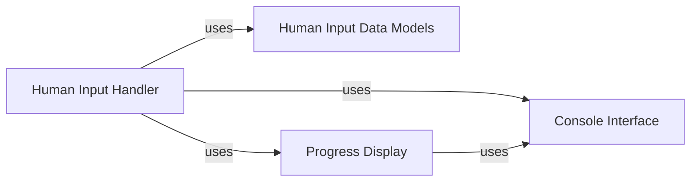

<Info>
This documentation was generated by [CodeBoarding](https://github.com/CodeBoarding/GeneratedOnBoardings) to provide comprehensive architectural insights into the mcp-agent framework.
</Info>

## Details

The `Human Interaction Layer` is a critical subsystem designed to facilitate seamless human-in-the-loop workflows within the AI agent framework. Its primary purpose is to enable agents to request information, receive feedback, and process responses from human users, thereby integrating human intelligence and decision-making into automated processes. This layer adheres to the project's architectural biases by promoting modularity, clear separation of concerns, and an asynchronous design, ensuring that human interactions do not block core agent operations.

### Human Input Handler
This is the central orchestrator for managing human input. It's responsible for presenting prompts to the user, capturing their input (distinguishing between simple text and structured commands), and then parsing that input to determine the appropriate action for the agent. It also coordinates with the display mechanism to manage the visual state during input.

**Related Classes/Methods**:

- <a href="https://github.com/lastmile-ai/mcp-agent/blob/main/mcp_agent/human_input/handler.py#L1-L1" target="_blank" rel="noopener noreferrer">`Human Input Handler` (1:1)</a>

### Human Input Data Models
This component defines the standardized data structures (e.g., `HumanInputRequest`) for all human-related input and output within the system. It ensures type safety, consistency, and a clear contract for information exchange between the agent framework and the human interaction components.

**Related Classes/Methods**:

- <a href="https://github.com/lastmile-ai/mcp-agent/blob/main/mcp_agent/human_input/types.py#L1-L1" target="_blank" rel="noopener noreferrer">`Human Input Data Models` (1:1)</a>

### Progress Display
This component, specifically `RichProgressDisplay`, is responsible for providing visual feedback to the user during agent operations. It manages the display of progress indicators, status messages, and other interactive elements, crucially pausing them when human input is pending and resuming them afterward to maintain a coherent user experience.

**Related Classes/Methods**:

- <a href="https://github.com/lastmile-ai/mcp-agent/blob/main/mcp_agent/logging/rich_progress.py#L1-L1" target="_blank" rel="noopener noreferrer">`Progress Display` (1:1)</a>

### Console Interface
This foundational component provides the low-level interface for interacting with the console. It handles the actual reading of input from `stdin` and writing output to `stdout`/`stderr`. While not exclusively part of the `human_input` package, it serves as the underlying I/O mechanism for any console-based human interaction.

**Related Classes/Methods**:

- <a href="https://github.com/lastmile-ai/mcp-agent/blob/main/mcp_agent/console.py#L1-L1" target="_blank" rel="noopener noreferrer">`Console Interface` (1:1)</a>

### [FAQ](https://github.com/CodeBoarding/GeneratedOnBoardings/tree/main?tab=readme-ov-file#faq)