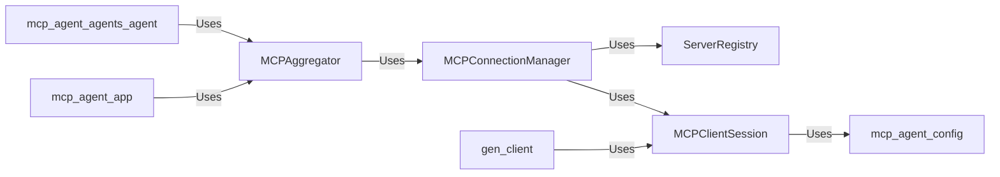

<Info>
This documentation was generated by [CodeBoarding](https://github.com/CodeBoarding/GeneratedOnBoardings) to provide comprehensive architectural insights into the mcp-agent framework.
</Info>

## Details

Abstract Components Overview

### MCPAggregator
The MCPAggregator serves as the central hub for collecting and consolidating capabilities from various MCP servers. It's responsible for presenting a unified view of available tools, prompts, and resources to the rest of the `mcp_agent` application, abstracting away the complexities of interacting with individual MCP services. This component is fundamental because it provides the agent with a comprehensive understanding of its available external capabilities, enabling dynamic tool and resource utilization.

**Related Classes/Methods**:

- <a href="https://github.com/lastmile-ai/mcp-agent/blob/main/src/mcp_agent/mcp/mcp_aggregator.py#L77-L1357" target="_blank" rel="noopener noreferrer">`mcp_agent.mcp.mcp_aggregator.MCPAggregator` (77:1357)</a>

### MCPConnectionManager
This component is responsible for the lifecycle management of network connections and communication sessions with MCP servers. It handles the establishment, maintenance, and termination of these connections, ensuring reliable and efficient communication. Its importance lies in providing a robust and abstract layer for network interactions, preventing other components from needing to manage low-level connection details.

**Related Classes/Methods**:

- <a href="https://github.com/lastmile-ai/mcp-agent/blob/main/src/mcp_agent/mcp/mcp_connection_manager.py" target="_blank" rel="noopener noreferrer">`mcp_agent.mcp.mcp_connection_manager.MCPConnectionManager`</a>

### ServerRegistry
The ServerRegistry acts as a persistent store for information about known MCP servers. It maintains their configurations, status, and other metadata, enabling the MCPConnectionManager and other components to discover and retrieve details about available MCP services. This component is fundamental for the dynamic discovery and management of external services, supporting the extensibility of the framework.

**Related Classes/Methods**:

- <a href="https://github.com/lastmile-ai/mcp-agent/blob/main/src/mcp_agent/mcp/mcp_server_registry.py" target="_blank" rel="noopener noreferrer">`mcp_agent.mcp.mcp_server_registry.ServerRegistry`</a>

### MCPClientSession
This component encapsulates the details of an individual client session with a specific MCP server. It handles the low-level mechanics of sending requests and receiving responses over a single connection. This separation of concerns ensures that the complexities of interacting with a single MCP server are isolated, promoting reusability and testability.

**Related Classes/Methods**:

- <a href="https://github.com/lastmile-ai/mcp-agent/blob/main/src/mcp_agent/mcp/mcp_agent_client_session.py" target="_blank" rel="noopener noreferrer">`mcp_agent.mcp.mcp_agent_client_session.MCPClientSession`</a>

### gen_client
This module contains auto-generated client code that provides concrete methods for interacting with MCP servers based on their defined protocols. It abstracts the underlying communication details, allowing higher-level components to make API calls to MCP services using a type-safe and convenient interface. This component is crucial for ensuring correct and efficient communication with diverse MCP servers.

**Related Classes/Methods**:

- <a href="https://github.com/lastmile-ai/mcp-agent/blob/main/src/mcp_agent/mcp/gen_client.py#L15-L40" target="_blank" rel="noopener noreferrer">`mcp_agent.mcp.gen_client` (15:40)</a>

### [FAQ](https://github.com/CodeBoarding/GeneratedOnBoardings/tree/main?tab=readme-ov-file#faq)