<Info>

```mermaid
graph LR
    Core_Application_Setup["Core Application & Setup"]
    Agent_Execution_Workflow_Engine["Agent Execution & Workflow Engine"]
    Agent_Core_LLM_Integration["Agent Core & LLM Integration"]
    MCP_Service_Integration["MCP Service Integration"]
    Agent_Workflow_Patterns["Agent Workflow Patterns"]
    Human_Interaction_Layer["Human Interaction Layer"]
    Core_Application_Setup -- "Configures" --> Agent_Execution_Workflow_Engine
    Core_Application_Setup -- "Configures" --> MCP_Service_Integration
    Agent_Execution_Workflow_Engine -- "Manages" --> Agent_Workflow_Patterns
    Agent_Execution_Workflow_Engine -- "Requests input from" --> Human_Interaction_Layer
    Agent_Core_LLM_Integration -- "Utilizes" --> MCP_Service_Integration
    Agent_Core_LLM_Integration -- "Provides capabilities to" --> Agent_Workflow_Patterns
    MCP_Service_Integration -- "Provides capabilities to" --> Agent_Core_LLM_Integration
    Agent_Workflow_Patterns -- "Orchestrates" --> Agent_Core_LLM_Integration
    Agent_Workflow_Patterns -- "Leverages" --> MCP_Service_Integration
    Human_Interaction_Layer -- "Provides input to" --> Agent_Execution_Workflow_Engine
    click Core_Application_Setup href "/codeboarding/Core_Application_Setup.mdx" "Details"
    click Agent_Execution_Workflow_Engine href "/codeboarding/Agent_Execution_Workflow_Engine.mdx" "Details"
    click Agent_Core_LLM_Integration href "/codeboarding/Agent_Core_LLM_Integration.mdx" "Details"
    click MCP_Service_Integration href "/codeboarding/MCP_Service_Integration.mdx" "Details"
    click Agent_Workflow_Patterns href "/codeboarding/Agent_Workflow_Patterns.mdx" "Details"
    click Human_Interaction_Layer href "/codeboarding/Human_Interaction_Layer.mdx" "Details"
```

This documentation was generated by [CodeBoarding](https://github.com/CodeBoarding/GeneratedOnBoardings) to provide comprehensive architectural insights into the mcp-agent framework.
</Info>

## Details

The `mcp-agent` project provides a robust framework for developing AI agents. At its core, the **Core Application & Setup** component initializes the entire system and manages configurations. The **Agent Execution & Workflow Engine** then takes over, orchestrating the execution of various **Agent Workflow Patterns** (like orchestration, routing, or parallel processing) which define the agent's high-level behaviors. These workflows, in turn, leverage the **Agent Core & LLM Integration** component to interact with Large Language Models and perform agent-specific actions. The **MCP Service Integration** component is crucial for discovering and connecting to external Model Context Protocol (MCP) servers, providing the necessary tools and resources to the agents. Finally, the **Human Interaction Layer** enables human-in-the-loop capabilities, allowing agents to request and receive input from users, which is then processed by the Execution Engine.

### Core Application & Setup [[Expand]](./Core_Application_Setup)
Initializes the entire agent framework, establishes the global application context, and manages the loading, parsing, and provision of application settings and sensitive information. It acts as the central orchestrator for the agent's environment and ensures all components operate with correct parameters.

**Related Classes/Methods**:

- <a href="https://github.com/lastmile-ai/mcp-agent/blob/main/src/mcp_agent/app.py#L1-L1" target="_blank" rel="noopener noreferrer">`mcp_agent/app.py` (1:1)</a>
- <a href="https://github.com/lastmile-ai/mcp-agent/blob/main/src/mcp_agent/config.py#L1-L1" target="_blank" rel="noopener noreferrer">`mcp_agent/config.py` (1:1)</a>

### Agent Execution & Workflow Engine [[Expand]](./Agent_Execution_Workflow_Engine)
Manages the lifecycle and execution of tasks, activities, and complex workflows. It provides mechanisms for registering executable units and handling their state, supporting both immediate asynchronous execution and durable, long-running workflows.

**Related Classes/Methods**:

- <a href="https://github.com/lastmile-ai/mcp-agent/blob/main/src/mcp_agent/executor/executor.py#L1-L1" target="_blank" rel="noopener noreferrer">`mcp_agent/executor/executor.py` (1:1)</a>
- <a href="https://github.com/lastmile-ai/mcp-agent/blob/main/src/mcp_agent/executor/task_registry.py#L1-L1" target="_blank" rel="noopener noreferrer">`mcp_agent/executor/task_registry.py` (1:1)</a>
- <a href="https://github.com/lastmile-ai/mcp-agent/blob/main/src/mcp_agent/executor/signal_registry.py#L1-L1" target="_blank" rel="noopener noreferrer">`mcp_agent/executor/signal_registry.py` (1:1)</a>
- <a href="https://github.com/lastmile-ai/mcp-agent/blob/main/src/mcp_agent/executor/decorator_registry.py#L1-L1" target="_blank" rel="noopener noreferrer">`mcp_agent/executor/decorator_registry.py` (1:1)</a>
- <a href="https://github.com/lastmile-ai/mcp-agent/blob/main/src/mcp_agent/executor/workflow.py#L1-L1" target="_blank" rel="noopener noreferrer">`mcp_agent/executor/workflow.py` (1:1)</a>

### Agent Core & LLM Integration [[Expand]](./Agent_Core_LLM_Integration)
Defines the fundamental interface and capabilities of an AI agent. It encapsulates interactions with Large Language Models (LLMs), external tools, prompts, and resources, providing a consistent and extensible model for agent behavior. It also offers a standardized and augmented interface for interacting with various LLM providers.

**Related Classes/Methods**:

- <a href="https://github.com/lastmile-ai/mcp-agent/blob/main/src/mcp_agent/agents/agent.py#L1-L1" target="_blank" rel="noopener noreferrer">`mcp_agent/agents/agent.py` (1:1)</a>
- <a href="https://github.com/lastmile-ai/mcp-agent/blob/main/src/mcp_agent/workflows/llm/augmented_llm.py#L1-L1" target="_blank" rel="noopener noreferrer">`mcp_agent/workflows/llm/augmented_llm.py` (1:1)</a>
- <a href="https://github.com/lastmile-ai/mcp-agent/blob/main/src/mcp_agent/workflows/llm/llm_selector.py#L1-L1" target="_blank" rel="noopener noreferrer">`mcp_agent/workflows/llm/llm_selector.py` (1:1)</a>

### MCP Service Integration [[Expand]](./MCP_Service_Integration)
Serves as a central point for discovering, collecting, and managing capabilities (tools, prompts, resources) exposed by various Model Context Protocol (MCP) servers. It also manages the underlying network connections and communication sessions with these external services.

**Related Classes/Methods**:

- <a href="https://github.com/lastmile-ai/mcp-agent/blob/main/src/mcp_agent/mcp/mcp_aggregator.py#L1-L1" target="_blank" rel="noopener noreferrer">`mcp_agent/mcp/mcp_aggregator.py` (1:1)</a>
- <a href="https://github.com/lastmile-ai/mcp-agent/blob/main/src/mcp_agent/mcp/mcp_connection_manager.py#L1-L1" target="_blank" rel="noopener noreferrer">`mcp_agent/mcp/mcp_connection_manager.py` (1:1)</a>
- <a href="https://github.com/lastmile-ai/mcp-agent/blob/main/src/mcp_agent/mcp/mcp_server_registry.py#L1-L1" target="_blank" rel="noopener noreferrer">`mcp_agent/mcp/mcp_server_registry.py` (1:1)</a>

### Agent Workflow Patterns [[Expand]](./Agent_Workflow_Patterns)
Implements various complex, multi-step agent behaviors and patterns. This includes orchestrating sequences of actions, routing requests, classifying user intents, parallelizing LLM calls, and facilitating collaborative problem-solving among multiple agents.

**Related Classes/Methods**:

- <a href="https://github.com/lastmile-ai/mcp-agent/blob/main/src/mcp_agent/workflows/orchestrator/orchestrator.py#L1-L1" target="_blank" rel="noopener noreferrer">`mcp_agent/workflows/orchestrator/orchestrator.py` (1:1)</a>
- <a href="https://github.com/lastmile-ai/mcp-agent/blob/main/src/mcp_agent/workflows/router/router_base.py#L1-L1" target="_blank" rel="noopener noreferrer">`mcp_agent/workflows/router/router_base.py` (1:1)</a>
- <a href="https://github.com/lastmile-ai/mcp-agent/blob/main/src/mcp_agent/workflows/intent_classifier/intent_classifier_base.py#L1-L1" target="_blank" rel="noopener noreferrer">`mcp_agent/workflows/intent_classifier/intent_classifier_base.py` (1:1)</a>
- <a href="https://github.com/lastmile-ai/mcp-agent/blob/main/src/mcp_agent/workflows/parallel/parallel_llm.py#L1-L1" target="_blank" rel="noopener noreferrer">`mcp_agent/workflows/parallel/parallel_llm.py` (1:1)</a>
- <a href="https://github.com/lastmile-ai/mcp-agent/blob/main/src/mcp_agent/workflows/swarm/swarm.py#L1-L1" target="_blank" rel="noopener noreferrer">`mcp_agent/workflows/swarm/swarm.py` (1:1)</a>

### Human Interaction Layer [[Expand]](./Human_Interaction_Layer)
Handles all interactions requiring human input or feedback. It provides mechanisms for agents to request information from users and process their responses, enabling human-in-the-loop workflows.

**Related Classes/Methods**:

- <a href="https://github.com/lastmile-ai/mcp-agent/blob/main/src/mcp_agent/human_input/handler.py#L1-L1" target="_blank" rel="noopener noreferrer">`mcp_agent/human_input/handler.py` (1:1)</a>
- <a href="https://github.com/lastmile-ai/mcp-agent/blob/main/src/mcp_agent/human_input/types.py#L1-L1" target="_blank" rel="noopener noreferrer">`mcp_agent/human_input/types.py` (1:1)</a>

### [FAQ](https://github.com/CodeBoarding/GeneratedOnBoardings/tree/main?tab=readme-ov-file#faq)